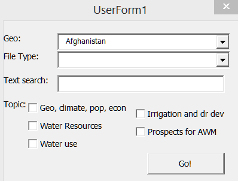
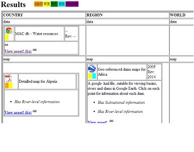

AQ2 Asset viewer motivation
========================================================
author: Amit Kohli
date: 2014.07.25

Introduction
========================================================

Main Problem: Assets of the AQUASTAT programme are very varied and dispersed; Users frequently find some but not all products. Since users are varied, some are looking for info by country, others by topic, and others by type.

Solution: Provide an interface that unites assets from:

- Main country database
- Website
- Various topical analyses

... and provide all assets in one easy to use platform, temporarily
called AQ2 (2nd query form for AQUASTAT).

Walk before you can run
========================================================

This project is possible due to a significant effort to 
process 'unstructured data'. Processing includes Standardization (mainly in terms of file-names and locations) and metadata assignment, which allows assets to be treated logically (and also allows them to be put in a database and queried :) ). As 
you can imagine, this has been, and continues to be a considerable task.

About 3 000 assets have been identified (many of which are dynamic links that in turn query our main database, but are not included here for simplicity). This project uses a 
small selection of these (507 entries) as a proof of concept.

Notable challenges
===================================================

- The main problem is to find a way to standardize different assets that have been generated over more than a decade. The approach selected was to have an excel file that used macros and userforms to help various staff complete standardization exercises, and metadata assignment.

- Asset allocation to a country is sometimes tricky. Consider the difference between a global table with data on many countries, and a global report with information about the world.

In the first case, it's a world-level file, with information on individual countries, whereas the second is a world-level file 
with information about the world. (*file* and *offered* areas)

Presentation thoughts
===============================================
- OK, so make a front-end to query assets, but how should results be presented? First conceptual mockup consisted of a two step process:

1. Since the list of assets was in Excel, use VBA to create an html file for each asset (name of html file is asset ID)
2. Make a query userform that identifies queried assets, gets the corresponding html files, and INCLUDES them into a results page in the appropriate 'box'

Query userform  | Result page
------------- | -------------
|

Final product!
===============

The mockup proved that the idea 'was cute', but unwieldy, had a lot of moving parts, and would require lots of messing around in css... (read: Expensive, ugly and brittle!)

Enter Shiny :)

Decided to prove the concept with a table. It's intuitive and simple enough for everybody to use. With no further ado:

[Go to my project!](http://amit.shinyapps.io/AQ_asset_viewer/)

Note: This is far from a finished product. Country names and IDs are not harmonized, most assets are absent, and no parsing has been done (see my [to-do list](https://github.com/mexindian/AQ2/blob/master/to-do.txt) to see more details). It's at a good point to show the tool flexibility and to take the next and final step based on this.
